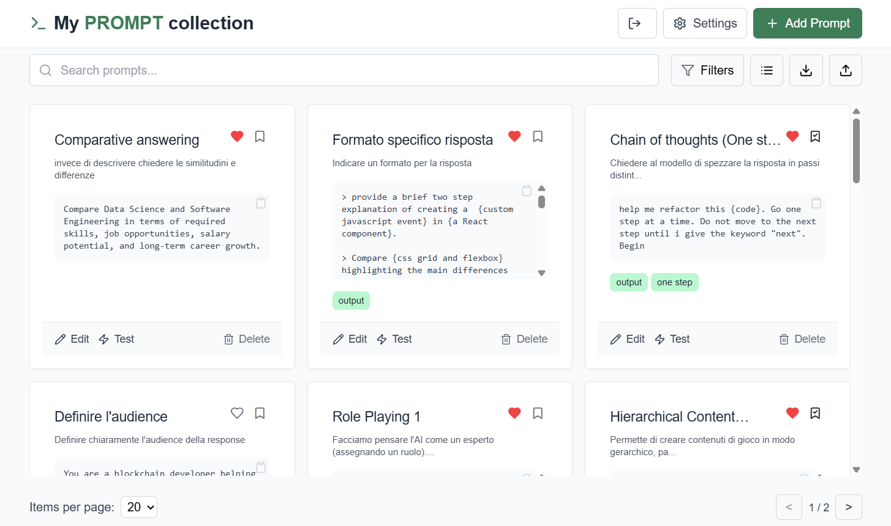

# My Prompt Library

My Prompt Library is a web application designed to help users manage and organize their collection of prompts. It provides features for creating, editing, testing, and categorizing prompts, making it a powerful tool for prompt-based workflows.

## Features

- **User Authentication**: Secure login/logout with [Firebase](https://firebase.google.com/); private prompt collections for each user.
- **Prompt Management**: Add, edit, and delete prompts with details like name, description, content, and tags.
- **Prompt Categorization**: Use tags, templates, and favorites for organization and quick access.
- **Prompt Testing**: Test prompts directly within the app using LLM settings ([Ollama](https://www.ollama.com/) as default).
- **Filters and Search**: Filter by tags, templates, or favorites; search by name or description.
- **Pagination**: View prompts in paginated form (10, 20, or 50 per page).
- **View Modes**: Switch between Card View and Table View for displaying prompts.
- **Settings**: Customize theme (light, dark, or system) and default LLM configuration.
- **Responsive Design**: Fully responsive for desktops, tablets, and mobile devices.

## Technologies Used
- **React + TypeScript**
- **Firebase**
- **Tailwind CSS**
- **Lucide Icons**
- **Firebase (Firestore DB)**

## License
This project is licensed under the MIT License. See the `LICENSE` file for details.

## Acknowledgments
Feel free to contribute to the project by submitting issues or pull requests!
